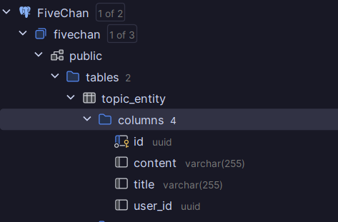

# FiveChan
___

## Integrantes
- Fabricio Jesús Huaquisto Quispe
- Erick Malcoaccha Diaz
- Marko Sumire Ramos
- Christian Taipe Saraza
- Alonso Chullunquia Rosas
- Sergio Castillo


### Erick Malcoaccha
#### Clean Code

##### 1. Nombrado Significativo

Los nombres de las clases y métodos son claros y descriptivos.

**Ejemplo:**

```java
public class UserEntity {
    @Id
    private UUID id;
    private String name;
    private String description;
    private String avatar;
    private String email;

    // Métodos
}
```
##### 2. Funciones Pequeñas y Centradas
Cada método realiza una tarea específica, lo que facilita su comprensión y mantenimiento.

```java
@Override
@Transactional
public void save(User user) {
    UserEntity userEntity = UserEntity.fromDomain(user);
    entityManager.persist(userEntity);
}

@Override
public User findById(UUID id) {
    UserEntity userEntity = entityManager.find(UserEntity.class, id);
    return userEntity != null ? userEntity.toDomain() : null;
}

```
##### 3. Evitar commentarios inncesarios
El código es autoexplicativo, lo que minimiza la necesidad de comentarios adicionales.

```java
@Override
public User findByUsername(String username) {
    try {
        UserEntity userEntity = entityManager.createQuery("SELECT u FROM UserEntity u WHERE u.name = :username", UserEntity.class)
                .setParameter("username", username)
                .getSingleResult();
        return userEntity.toDomain();
    } catch (jakarta.persistence.NoResultException e) {
        return null;
    }
}

```

#### Solid

##### 1. Principio de Responsabilidad Única
Cada clase tiene una única responsabilidad.

```java
@Service
public class UserService {
    private final UserRepository userRepository;

    @Autowired
    public UserService(UserRepository userRepository) {
        this.userRepository = userRepository;
    }

    public void createUser(UUID id, String name, String description, String avatar, String email) {
        this.userRepository.save(new User(id, name, description, avatar, email));
    }
}

```
```java
@Repository
public class JpaUserRepository implements UserRepository {
    @PersistenceContext
    protected EntityManager entityManager;

    @Override
    @Transactional
    public void save(User user) {
        UserEntity userEntity = UserEntity.fromDomain(user);
        entityManager.persist(userEntity);
    }

    // Otros métodos
}

```

##### 2. Open/Closed Principle (OCP)
Las clases son abiertas para extenderse pero cerradas para modificarse.

```java
public interface UserRepository {
    void save(User user);
    List<User> findAll();
    User findById(UUID id);
    User findByUsername(String username);
    User findByEmail(String email);
    void deleteById(UUID id);
    void updateById(UUID id, User user);
}
```

```java
@Repository
public class JpaUserRepository implements UserRepository {
    @PersistenceContext
    protected EntityManager entityManager;

    @Override
    @Transactional
    public void save(User user) {
        UserEntity userEntity = UserEntity.fromDomain(user);
        entityManager.persist(userEntity);
    }

    // Otros métodos
}
```
#### Styles of programming

##### 1. Cookbook

Este estilo implica tener recetas específicas para realizar tareas comunes. Los métodos en `JpaUserRepository` siguen un patrón repetitivo y bien definido para las operaciones CRUD.

**Ejemplo:**

```java
@Override
@Transactional
public void save(User user) {
    UserEntity userEntity = UserEntity.fromDomain(user);
    entityManager.persist(userEntity);
}

@Override
public User findById(UUID id) {
    UserEntity userEntity = entityManager.find(UserEntity.class, id);
    return userEntity != null ? userEntity.toDomain() : null;
}
```
##### 2. Pipeline
Este estilo se refiere a procesar datos a través de una serie de pasos o etapas. En la conversión entre User y UserEntity.
```java

public User toDomain() {
    return new User(id, name, description, avatar, email);
}

public static UserEntity fromDomain(User user) {
    return new UserEntity(user.getId(), user.getName(), user.getDescription(), user.getAvatar(), user.getEmail());
}
```

##### 3. Restful

```Java
@RestController
@RequestMapping("/users")
public class UserController {
    private final UserService userService;

    @Autowired
    public UserController(UserService userService) {
        this.userService = userService;
    }

    @PostMapping
    public void createUser(@RequestBody UserDTO user) {
        UUID id = UUID.randomUUID();
        this.userService.createUser(id, user.getName(), user.getDescription(), user.getAvatar(), user.getEmail());
    }
}
```

### Fabricio Huaquisto
#### Clean Code

##### 1. Nombrado Significativo

Los nombres de las clases y métodos son claros y descriptivos.

**Ejemplo:**

```java
public class TopicEntity {
    @Id
    private UUID id;
    private UUID userId;
    private String title;
    private String content;

    // Métodos
}
```
```java
public class Topic {
    private UUID id;
    private UUID userId;
    private String title;
    private String content;
    
    // Métodos
}
```

##### 2. Funciones Pequeñas y Centradas
Cada método realiza una tarea específica, lo que facilita su comprensión y mantenimiento.

```java
@Override
@Transactional
public void update(Topic topic) {
    TopicEntity topicEntity = TopicEntity.fromDomain(topic);
    entityManager.merge(topicEntity);
}

@Override
public List<Topic> findByUserId(UUID userId) {
    TypedQuery<TopicEntity> query = entityManager.createQuery(
            "SELECT t FROM TopicEntity t WHERE t.userId = :userId", TopicEntity.class);
    query.setParameter("userId", userId);
    return query.getResultList().stream()
            .map(TopicEntity::toDomain)
            .toList();
}

```


#### Estilos de programación

##### 1. Restful

```Java
@RestController
@RequestMapping("/topic")
public class TopicController {
    private final TopicService topicService;

    @Autowired
    public TopicController(TopicService topicService) {
        // ...
    }

    @PostMapping
    public  void createTopic(@RequestBody TopicDTO topic) {
        // ...
    }
}
```

#### 2. Error/Exception Handling

```java
 @ResponseStatus(value=HttpStatus.NOT_FOUND, reason="Topic no encontrado")  // 404
 public class TopicNotFoundException extends RuntimeException {
     // ...
 }
```

Esta excepción personalizada se usa en:

```java
@PostMapping("/{id}")
public void findTopic(@RequestBody UUID topicId) {
    Topic topic = this.topicRepository.findById(topicId);
    
    if (topic == null) throw new TopicNotFoundException(topicId);
    
    return topic;
}
```

#### 3. Persistent-Tables

```java
@Entity
public class TopicEntity {
    @Id
    private UUID id;
    private UUID userId;
    private String title;
    private String content;
    
    // ...
}
```

```java
@Repository
public class JpaTopicRepository implements TopicRepository {
    @PersistenceContext
    protected EntityManager entityManager;
    
    // ...
}
```


